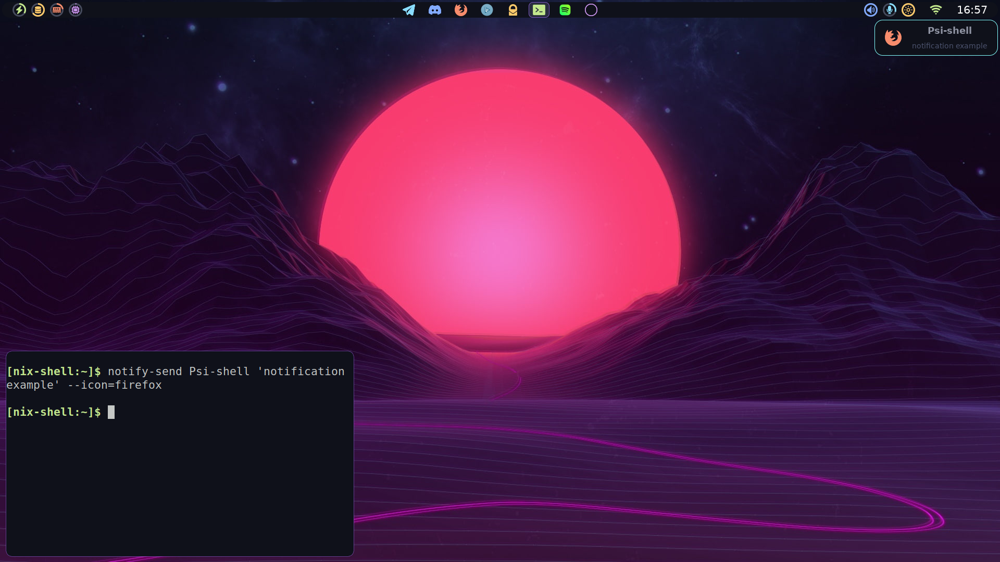

# Psi Shell

A minimalistic desktop shell.

Currently, everything is nailed down and non-configurable.   
Configurability is not a priority right now as it's mostly intended for personal usage.   

The next priority is to drop `GTK` and replace it with something Rust-native, like [iced](https://github.com/iced-rs/iced).   
But there are no properly working `layer-shell` implementations for Rust-native GUI toolkits, yet.

# Example

